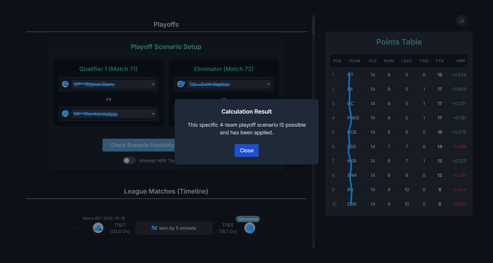

# IPL Scenario Simulator

This project is a web application built with React, Vite, TypeScript, and Tailwind CSS that allows users to simulate different scenarios for the Cricket Leagues. Users can input hypothetical results for remaining matches and see the impact on the points table, team qualification chances, and potential playoff positions. The application features a modern, fluid UI with a tree-based interface for scenario building.

## Features

*   Display IPL fixtures (completed and upcoming).
*   Show the official points table and dynamically update it based on user scenarios.
*   Allow users to assign outcomes (Win/Loss/Tie) to upcoming matches.
*   Visualize scenarios using an interactive interface.
*   Calculate and display the possibility of each team qualifying for the playoffs.
*   Answer queries like "How can Team X qualify?".
*   Handle Net Run Rate (NRR) calculations for tie-breaking.
*   Modern UI/UX with fluid animations.

## Technology Stack

*   **Frontend Framework:** React (with Vite)
*   **Language:** TypeScript
*   **Styling:** Tailwind CSS
*   **Animation:** Framer Motion
*   **State Management:** Zustand

## Demo
**Access at https://cricket-analyzer.pages.dev/**
<br></br>


## Algorithm

The core logic for determining playoff possibilities resides in a Web Worker (`src/logic/scenarioWorker.ts`) to prevent blocking the main UI thread. It uses a recursive backtracking algorithm combined with pruning techniques to efficiently explore the vast space of potential outcomes for remaining matches.

Here's a breakdown of the process:

1.  **Initialization (React Hook):**
    *   The `usePlayoffValidationWorker` hook (`src/hooks/usePlayoffValidationWorker.ts`) manages the interaction with the worker.
    *   It identifies the remaining fixtures based on the completed results.
    *   It initializes the Web Worker.

2.  **Worker Invocation:**
    *   When the user requests a scenario check (e.g., "Can Team X qualify?" or "Is this specific Top 4 possible?"), the hook sends a message to the worker.
    *   This message includes:
        *   The list of remaining fixtures.
        *   The results of already completed matches (`baseResults`).
        *   Information about all teams.
        *   The specific query type (`CHECK_SINGLE_TEAM` or `VALIDATE_4_TEAMS`) and the target team(s).

3.  **Recursive Backtracking (Worker):**
    *   The `findPossibleScenario` function in the worker recursively explores outcomes for each remaining match.
    *   **Base Case:** If all matches have been assigned an outcome, calculate the final points table (including NRR using `calculatePointsTable` from `src/logic/scoreCalculator.ts`). Check if this final table satisfies the user's query (e.g., does the target team rank in the top 4?). If yes, return the sequence of simulated match results that led to this valid scenario.
    *   **Recursive Step:** For the current match being considered:
        *   Iterate through possible outcomes (Home Win, Away Win, Tie).
        *   For each outcome, generate a plausible scoreline using `generatePlausibleScores` (this is crucial for NRR calculations). Add this simulated `CompletedMatch` to the current path.
        *   **Pruning:** Before recursing deeper, apply pruning checks:
            *   Calculate the maximum possible points the target team(s) can achieve given the remaining matches (`calculateMaxPossiblePoints`).
            *   Compare this maximum potential with the *current* points of teams around the qualification cutoff (e.g., 4th place) in the *intermediate* points table (calculated based on base results + currently simulated results).
            *   If the target team(s) cannot mathematically reach the required points threshold even if they win all remaining matches, prune this branch (stop exploring down this path).
        *   If not pruned, recursively call `findPossibleScenario` for the next match.
        *   If the recursive call returns a valid scenario, propagate it back up.
        *   **Backtrack:** Remove the simulated result for the current match outcome to explore other possibilities.

4.  **Result Communication:**
    *   If the worker finds a valid scenario, it sends a 'RESULT' message back to the hook containing `isPossible: true` and the `scenario` (list of simulated results).
    *   If the entire search space is explored without finding a valid scenario (or if pruned branches eliminate all possibilities), it sends `isPossible: false`.
    *   Error messages are also handled.

5.  **UI Update (React Hook):**
    *   The hook receives the message from the worker.
    *   It updates the application state (via Zustand store) with the result (`isPossible`, message).
    *   If a valid scenario was found (`isPossible: true`), it applies the simulated results (`applyScenarioResults`) to update the displayed fixtures and points table, showing the user *one way* the requested outcome can occur.
    *   Displays a popup message to the user indicating success or failure.

**Detailed Python-Style Pseudocode for the Core Worker Logic:**

```python
def find_possible_scenario(fixture_index, remaining_fixtures, current_simulated_results, base_results, query_type, target_data):
    """
    Recursively explores scenarios to find one matching the query.

    Args:
        fixture_index: Index of the current fixture to simulate.
        remaining_fixtures: List of fixtures yet to be simulated.
        current_simulated_results: List of outcomes simulated in the current path.
        base_results: List of results of matches already completed.
        query_type: String ('CHECK_SINGLE_TEAM' or 'VALIDATE_4_TEAMS').
        target_data: Dict containing target team ID(s) for the query.

    Returns:
        List of simulated results if a valid scenario is found, otherwise None.
    """

    # --- Pruning Check ---
    intermediate_results = base_results + current_simulated_results
    intermediate_table = calculate_points_table(intermediate_results) # Includes NRR
    remaining_fixtures_for_pruning = remaining_fixtures[fixture_index + 1:]

    should_prune = False
    if query_type == 'CHECK_SINGLE_TEAM':
        target_team_id = target_data['teamId']
        # Find team entry (returns None if not found)
        target_team_entry = next((entry for entry in intermediate_table if entry['team']['id'] == target_team_id), None)
        current_points = target_team_entry['points'] if target_team_entry else 0
        max_possible_points = calculate_max_possible_points(target_team_id, current_points, remaining_fixtures_for_pruning)

        if len(intermediate_table) >= 4:
            fourth_team_points = intermediate_table[3]['points'] # 4th team's current points
            # Find rank (index)
            target_rank = next((i for i, entry in enumerate(intermediate_table) if entry['team']['id'] == target_team_id), -1)
            if target_rank >= 4 and max_possible_points < fourth_team_points:
                should_prune = True

    elif query_type == 'VALIDATE_4_TEAMS':
        required_teams = [target_data[key] for key in ['q1Team1Id', 'q1Team2Id', 'elTeam1Id', 'elTeam2Id'] if target_data[key] is not None]
        if len(intermediate_table) >= 4 and required_teams:
            fourth_team_points = intermediate_table[3]['points']
            for required_team_id in required_teams:
                required_team_entry = next((entry for entry in intermediate_table if entry['team']['id'] == required_team_id), None)
                current_points = required_team_entry['points'] if required_team_entry else 0
                max_possible_points = calculate_max_possible_points(required_team_id, current_points, remaining_fixtures_for_pruning)
                if max_possible_points < fourth_team_points:
                    should_prune = True
                    break # Exit loop early

    if should_prune:
        return None # Prune this branch

    # --- Base Case: All fixtures simulated ---
    if fixture_index == len(remaining_fixtures):
        final_results = base_results + current_simulated_results
        final_table = calculate_points_table(final_results) # Includes NRR
        is_scenario_valid = check_qualification(final_table, query_type, target_data)
        if is_scenario_valid:
            return list(current_simulated_results) # Return a copy
        else:
            return None

    # --- Recursive Step ---
    current_fixture = remaining_fixtures[fixture_index]
    possible_outcomes = ['home_win', 'away_win', 'tie']

    for outcome in possible_outcomes:
        # Simulate the outcome with plausible scores for NRR
        simulated_result = simulate_outcome(current_fixture, outcome)
        current_simulated_results.append(simulated_result) # Explore this path

        # Recursive call for the next fixture
        found_scenario = find_possible_scenario(
            fixture_index + 1,
            remaining_fixtures,
            current_simulated_results,
            base_results,
            query_type,
            target_data
        )

        # Backtrack: Remove the last simulated result
        current_simulated_results.pop()

        # If a valid scenario was found down that path, return it immediately
        if found_scenario is not None:
            return found_scenario
        # Otherwise, continue loop to try the next outcome

    # If no outcome from this fixture leads to a valid scenario
    return None


def check_qualification(final_table, query_type, target_data):
    """
    Checks if the final points table satisfies the user's query.

    Args:
        final_table: List of sorted points table entries (dict-like objects).
        query_type: String ('CHECK_SINGLE_TEAM' or 'VALIDATE_4_TEAMS').
        target_data: Dict containing target team ID(s).

    Returns:
        Boolean: True if the table satisfies the query, False otherwise.
    """
    if len(final_table) < 4:
        return False # Not enough teams

    top_4_ids = [entry['team']['id'] for entry in final_table[:4]]
    top_4_set = set(top_4_ids)

    if query_type == 'CHECK_SINGLE_TEAM':
        target_team_id = target_data['teamId']
        return target_team_id in top_4_set

    elif query_type == 'VALIDATE_4_TEAMS':
        # Check for duplicates in the actual top 4 first
        if len(top_4_set) < 4:
            return False # Invalid scenario if duplicates in top 4

        # Check if specified teams match the calculated top 4 slots
        target_slots = [target_data['q1Team1Id'], target_data['q1Team2Id'], target_data['elTeam1Id'], target_data['elTeam2Id']]
        for i in range(4):
            target_id_in_slot = target_slots[i]
            calculated_id_in_slot = top_4_ids[i]
            # If a specific team is required for this slot, it must match
            if target_id_in_slot is not None and target_id_in_slot != calculated_id_in_slot:
                return False # Mismatch
        return True # All specified slots match

    else:
        return False # Unknown query type
```

## Getting Started

1.  **Clone the repository:**
    ```bash
    git clone <repository-url>
    cd cricket-simulator
    ```
2.  **Install dependencies:**
    ```bash
    npm install
    ```
3.  **Run the development server:**
    ```bash
    npm run dev
    ```
4.  Open your browser and navigate to the local URL provided (usually `http://localhost:5173`).

## Disclaimer

This is an unofficial tool and does not host any copyrighted data. Any logos used are under fair-use.
